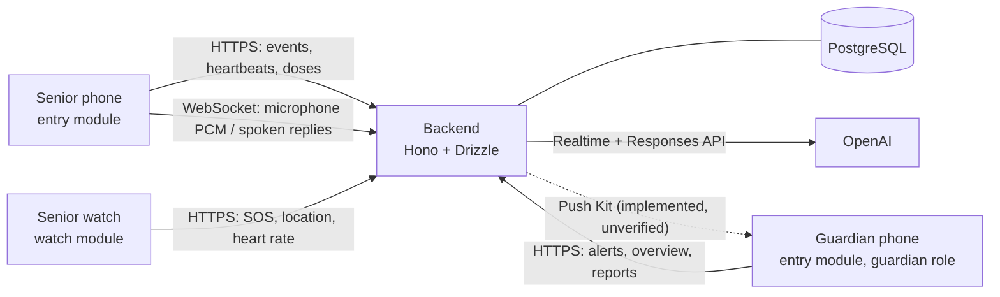

# Architecture

Carely has three clients and one backend. All clients are native HarmonyOS apps
(ArkTS, ArkUI, Stage model) in one bundle, `pl.solvro.hackyeah26`.

- **`entry`** (phone/tablet): one app with two roles. The senior gets SOS,
  safe area, medication, contacts and the wellbeing check-in. The guardian
  gets alerts, location, medication and wellbeing reports.
- **`watch`** (wearable, round 466×466): pairs with a 6-digit code, then sends
  SOS, its own location and heart rate straight to the backend.
- **`backend/`**: stores configuration, relays safety events, detects missed
  doses and heartbeat gaps, relays the voice check-in to OpenAI, and notifies
  guardians. Geofencing, barcode scanning and 3D run on the device. See
  [`backend/README.md`](backend/README.md) for the API contract.

## App Structure (`entry/src/main/ets`)

| Layer | Contents |
| --- | --- |
| `pages`, `components` | ArkUI screens per role and shared accessible controls (`DesignSystem.ets`) |
| `services` | Application logic: SOS and pending-event retry, location sharing, medication schedule, guardian alert watcher, live voice session |
| `models` | Pure logic with unit tests: geofence state machine, dose schedule, PCM audio, alert location, wellbeing view models |
| `platform` | Thin wrappers around HarmonyOS Kits, so services can be tested without hardware |
| `providers/backend` | The HTTP API client and backend URL |

The `watch` module follows the same layering in its own module.

## Platform Capabilities

| Kit | Used for | Status |
| --- | --- | --- |
| Location Kit + Background Tasks Kit | Safe-area geofence; location continuous task keeps sharing on with the screen locked | Emulator (foreground); background on a device unverified |
| Sensor Service Kit | Watch heart rate (`READ_HEALTH_DATA`) | Wearable emulator, simulated values labelled SIMULATED |
| Audio Kit | `AudioCapturer` / `AudioRenderer` for the hands-free voice check-in | Built; full conversation on a target unverified |
| Network Kit | HTTPS API and the voice WebSocket | Emulator |
| Telephony Kit | One-tap call to a trusted contact or the senior | API 24 emulator dialer hand-off, not a completed cellular call |
| Scan Kit | Barcode-assisted medication entry | API 24 open/cancel recorded; decoding unverified; labelled simulated scan as fallback |
| ArkGraphics 3D | 3D medicine reference | Fails on the emulator; still render shown instead |
| Notification Kit | Local alert and report notifications | Phone E2E log records foreground polling/local notifications; report notifications need separate confirmation; remote Push Kit unverified |
| Contacts Kit, Map Kit (Petal Maps) | Pick a contact from the address book; open an alert location in Maps | Unverified |

These are recorded observations, not a new validation run. Target versions,
scope and remaining checks are in [`AI_WORKFLOW.md`](AI_WORKFLOW.md).

## Key Flows

- **SOS:** phone (5-second countdown) or watch (3-second countdown) → event
  with last known location → backend stores an alert → guardian sees it,
  acknowledges and can call. An SOS that cannot reach the backend is queued
  (on the phone in the safety-event outbox, on the watch in memory) and resent
  every 30 seconds under the same id, so the backend never alerts twice.
- **Safe area:** the senior phone checks each location fix against the
  guardian-set circle and confirms an exit or re-entry before sending it, so one
  noisy fix does not raise an alert.
- **Wellbeing check-in:** the senior taps once and talks. The phone streams
  microphone audio to the backend, which relays it to the OpenAI Realtime model
  and plays its replies. When the check-in ends, the backend writes a summary,
  deletes the transcript and notifies the guardian. Details:
  [AI feature disclosure](AI_WORKFLOW.md#ai-feature-disclosure).

## Failure Handling

- No network: safety events and dose answers are queued and retried; cached
  contacts stay usable. An event the backend rejects for good (4xx other than
  401/408/429) is dropped so it cannot block later alerts.
- Sign-out: asks for confirmation, then clears the token, the queues, the
  contact cache and the in-memory services, so a re-paired phone never shows
  the previous senior's data. App backup is disabled because the stored token
  must not be restored onto another device.
- Time zone: care times use Europe/Warsaw, and dose times are computed in the
  device's local time, so the device must be set to that zone.
- Location off or permission revoked: sharing stops and the app asks the senior
  to turn it back on.
- The AI is never on the safety path. If OpenAI fails, the check-in shows as
  unavailable; on a possible emergency the assistant tells the senior to press
  SOS and never sends one itself.
- Simulated inputs (emulator sensors, demo scans) are labelled on screen and in
  the data (`source: "simulated"`).

## Data Handling

The backend stores pairing/configuration, latest per-device heartbeat positions,
location-bearing safety events, dose records, heart-rate samples (7-day retention),
and wellbeing reports. Geofence decisions and watch heart-rate threshold decisions
are made on-device; this does **not** mean all location or health data stays there.
OpenAI receives check-in audio/transcripts and conversational context, not the
senior's stored location, doses or heart-rate readings. Open sessions retain
transcripts until summarization or the documented failure fallback. See
[`AI_WORKFLOW.md`](AI_WORKFLOW.md#ai-feature-disclosure) for the full inference flow.
